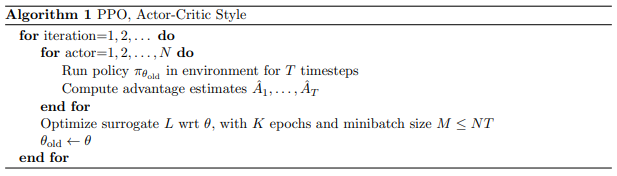
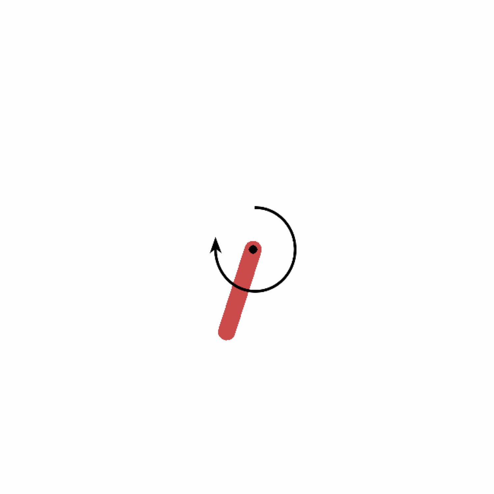
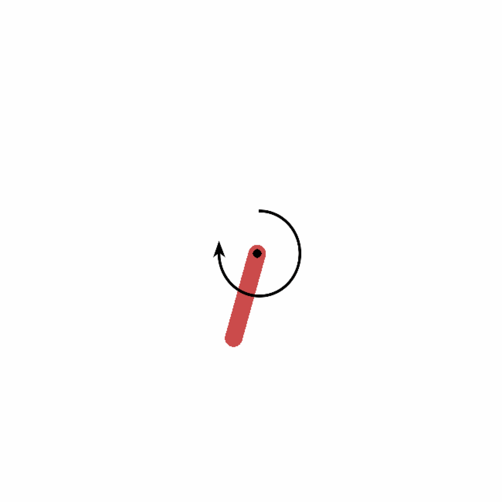
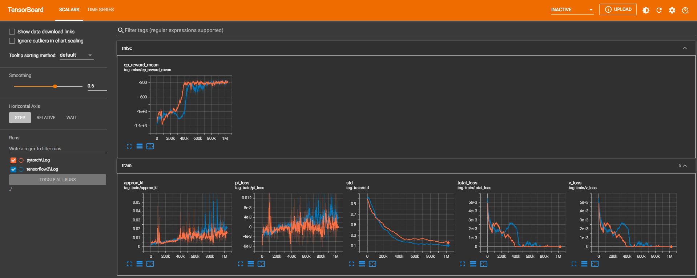

# Pendulum_PPO
Implementation of Proximal Policy Optimization (PPO) for continuous action space (`Pendulum-v1` from gym) using tensorflow2.x (keras) and pytorch.

The implementation provided here is from the original paper ([here](https://arxiv.org/abs/1707.06347)). The algorithm is shown below.


Some of the implementation details mentioned [here](https://iclr-blog-track.github.io/2022/03/25/ppo-implementation-details/) have also been used (e.g., advantage normalization, gradient clipping, etc).

To train the model, go to the folder for specific framework (tensorflow2 or pytorch) and run following command on terminal
```bash
python Pendulum_PPO.py train
```
This command trains the model. Neural networks (for policy and value) and hyper-parameters are defined in the file `Pendulum_PPO.py`. After training the model, it creates `season_reward.png` file in the folder `saved_images` that shows how policy improves with each season (plot varies with different run). It also saves trained neural network in the folder `saved_network` folder.

<table>
  <tr>
    <td>From tensorflow (keras)</td>
    <td>From pytorch</td>

  </tr>
  <tr>
    <td></td>
    <td></td>
  </tr>
</table>


After the model is trained, run following line at the terminal to evaluate the trained policy:
```bash
python Pendulum_PPO.py test
```
This gives gif file named `pendulum_run.gif` in the folder `saved_images`.

<table>
  <tr>
    <td>From tensorflow (keras)</td>
    <td>From pytorch</td>

  </tr>
  <tr>
    <td></td>
    <td></td>
  </tr>
</table>

To view the tensorboard log, go to parent directory of the repository and run following command at the terminal.
```bash
tensorboard --logdir ./
```

This will give following plot of tensorboard log.



Note: Above plots and animations are not meant to compare tensorflow and pytorch version since they varies on different run.