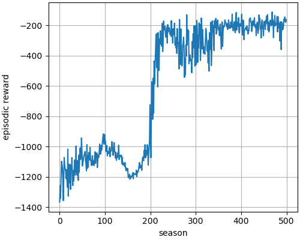

# Pendulum_PPO
Implementation of Proximal Policy Optimization (PPO) for continuous action space (`Pendulum-v1` from gym) using tensorflow2.x (keras) and pytorch.

To train the model, go to the folder for specific framework (tensorflow2 or pytorch) and run following command on terminal
```bash
python Pendulum_PPO.py train
```
This command trains the model. Neural networks (for policy and value) and hyper-parameters are defined in the file `Pendulum_PPO.py`. After training the model, it creates `season_reward.png` file that shows how policy improves with each season (plot varies with different run). 

<table>
  <tr>
    <td>From tensorflow (keras)</td>
    <td>From pytorch</td>

  </tr>
  <tr>
    <td></td>
    <!-- <td></td> -->
  </tr>
</table>


After the model is trained, run following line at the terminal to evaluate the trained policy:
```bash
python Pendulum_PPO.py test
```
This gives gif file named `pendulum_run.gif`.

<table>
  <tr>
    <td>From tensorflow (keras)</td>
    <td>From pytorch</td>

  </tr>
  <tr>
    <td></td>
    <!-- <td></td> -->
  </tr>
</table>
